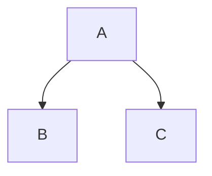

# Markdown 语法参考（完整版）

Markdown 语法按渲染器支持面分三层，查语法先定位在哪层——写错层的后果是换个渲染器就不生效。

## 一、CommonMark 基础

所有渲染器通用：标题、文本格式、列表、链接、引用、代码块、转义。

### 标题

```markdown
# 一级标题
## 二级标题
### 三级标题
```

### 文本格式

```markdown
**粗体**
*斜体*
~~删除线~~（GFM 扩展）
`行内代码`
`` 行内代码含`反引号`时 ``
```

### 列表

```markdown
- 无序列表项
- 嵌套列表项（缩进 2 空格）

1. 有序列表项
2. 第二项
   1. 嵌套有序列表对齐父项文字起始列

- [ ] 任务列表项（GFM 扩展）
- [x] 已完成任务
```

### 链接与图片

```markdown
[链接文字](https://example.com)

```

### 引用

```markdown
> 引用块文字
> > 嵌套引用
```

### 代码块

本仓写作约定优先列表：代码块必须带语言标签。

```ts
const greeting: string = "Hello";
```

```diff
- 删除的行
+ 新增的行
```

### 转义

```markdown
需要按字面输出的特殊字符用 \ 转义：\*、\[、\`
```

## 二、GFM 扩展

GFM 规范内，GitHub / GitLab 等广泛支持：表格、删除线、任务列表、URL autolink。

### 表格

本仓写作约定优先列表：语法参考里表格语法照常收录，但示例场景须注意本仓排版约定优先。

```markdown
| 列 1 | 列 2 |
| :--- | :--- |
| 单元格 1 | 单元格 2 |
```

### URL Autolink

```markdown
https://example.com
```

## 三、GitHub 专属

仅 GitHub.com 渲染器生效，未入 GFM 正式规范。

### 脚注

```markdown
文本带脚注[^1]。

[^1]: 脚注详细内容。
```

### Alerts（提示框）

```markdown
> [!NOTE]
> Useful information that users should know, even when skimming content.

> [!WARNING]
> Critical content demanding immediate attention due to potential risks.
```

### 折叠块（Collapsible sections）

```markdown
<details>
<summary>点击展开详情</summary>

折叠隐藏的内容。

</details>
```

### 数学公式

```markdown
行内公式：$E = mc^2$

块级公式：
$$
\sum_{i=1}^{n} i = \frac{n(n+1)}{2}
$$
```

### Mermaid 图表



### GitHub 引用自动链接（Citation autolinks）

GitHub 自动将仓库引用、commit 和用户引用转换为链接：

- Issue 或 pull request：`#123`（同仓库）或 `owner/repo#123`（跨仓库）
- Commit：40 位完整 SHA 或 7 位短 SHA，例如 `a5c3785`
- 用户和团队：`@username` 或 `@org/team`

### GeoJSON 和 TopoJSON 地图

使用 `geojson` 或 `topojson` 语言标识让 GitHub 渲染交互地图。

```geojson
{
  "type": "FeatureCollection",
  "features": []
}
```

```topojson
{
  "type": "Topology",
  "objects": {}
}
```

### STL 3D 模型

使用 `stl` 语言标识让 GitHub 渲染 ASCII STL 3D 模型。

```stl
solid example
endsolid example
```

规范出处：[CommonMark Spec](https://spec.commonmark.org/)、[GitHub Flavored Markdown](https://github.github.com/gfm/)
