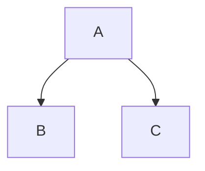

# Markdown 完整语法参考

Markdown 语法按渲染器支持面分三层，查语法先定位在哪层——写错层的后果是换个渲染器就不生效：

- CommonMark 基础（所有渲染器通用）：标题、文本格式、列表、链接、引用、代码块、转义
- GFM 扩展（GFM 规范内，GitHub / GitLab 等广泛支持）：表格、删除线、任务列表、URL autolink
- GitHub 专属（仅 GitHub.com 渲染器生效，未入 GFM 正式规范）：脚注、alerts、折叠块、数学公式、Mermaid、引用 autolink（`#123` / `@user` / SHA）、GeoJSON / STL

规范出处：[CommonMark Spec](https://spec.commonmark.org/)、[GitHub Flavored Markdown](https://github.github.com/gfm/)。

## 1. CommonMark 基础

### 标题

```markdown
# 一级标题
## 二级标题
### 三级标题
```

### 文本格式

```markdown
**粗体文本**
*斜体文本*
~~删除线~~ (GFM)
`行内代码`
``含`反引号`的行内代码``
```

### 列表

```markdown
- 无序列表项
- 无序列表项
  - 嵌套无序项（缩进 2 空格）

1. 有序列表项
2. 有序列表项
   1. 嵌套有序项

- [ ] 任务列表项待办 (GFM)
- [x] 任务列表项完成 (GFM)
```

### 链接与图片

```markdown
[链接文字](https://example.com)

```

### 引用

```markdown
> 引用区块文本
> > 嵌套引用
```

### 代码块

````markdown
```ts
const greeting: string = "Hello";
console.log(greeting);
```
````

## 2. GFM 扩展

### 表格

注：语法参考中表格语法照常收录（作为语法事实），但示例场景 MUST 注明本仓写作约定优先列表。

```markdown
| 列头 1 | 列头 2 |
| :--- | ---: |
| 左对齐 | 右对齐 |
```

### URL autolink

```markdown
https://example.com
```

## 3. GitHub 专属

### Alerts (警示框)

```markdown
> [!NOTE]
> Useful information that users should know, even when skimming content.

> [!WARNING]
> Critical content demanding immediate user attention due to potential risks.
```

### 折叠块

```markdown
<details>
<summary>点击展开详情</summary>

折叠隐藏的内容...

</details>
```

### 数学公式

```markdown
行内公式：$E = mc^2$

块级公式：
$$\sum_{i=1}^{n} i = \frac{n(n+1)}{2}$$
```

### Mermaid 图表

````markdown

````

### 脚注

```markdown
这里有一句话[^1]。

[^1]: 脚注详细解释内容。
```

### GitHub citation autolinks

GitHub 自动将以下引用转为链接：

- Issue / PR：`#123`（同仓库）、`owner/repo#123`（跨仓库）
- Commit：40 位完整 SHA 或 7 位短 SHA（如 `a5c3785`）
- 用户：`@username`；团队：`@org/team`

### GitHub code highlighting

围栏代码块在开栏反引号后写语言标识。`diff` 高亮可突出前后变化：

````markdown
```diff
- 删除的行
+ 新增的行
```
````

### GitHub GeoJSON and TopoJSON maps

使用 `geojson` 或 `topojson` 语言标识让 GitHub 渲染交互地图：

````markdown
```geojson
{
  "type": "FeatureCollection",
  "features": []
}
```

```topojson
{
  "type": "Topology",
  "objects": {}
}
```
````

### GitHub STL models

使用 `stl` 语言标识让 GitHub 渲染 ASCII STL 3D 模型：

````markdown
```stl
solid example
endsolid example
```
````
